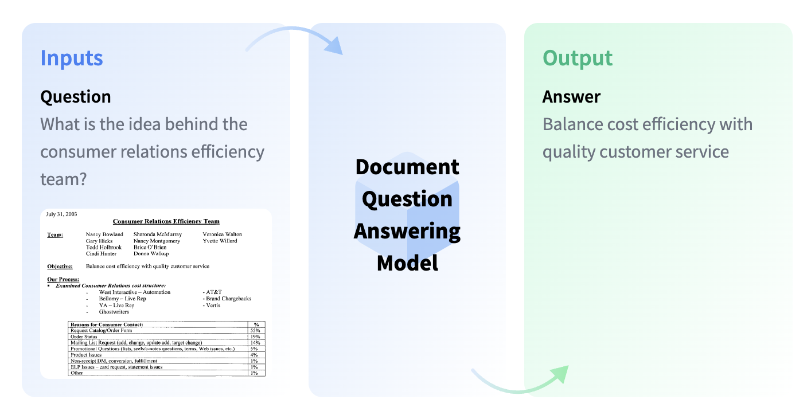
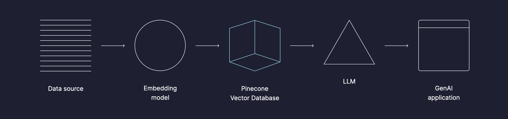
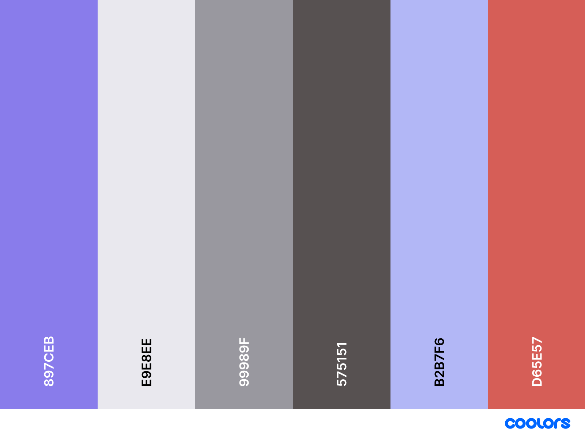

# Document QA System

## What is a Document Question Answering System?

Document Question Answering models can be used to answer natural language questions about documents. Typically, Document QA models consider textual, layout, and potentially visual information. This is useful when the question requires some understanding of the visual aspects of the document. Nevertheless, certain Document QA models can work without document images. Hence the task is not limited to visually-rich documents and allows users to ask questions based on spreadsheets, text, PDFs, etc.

<figure>
  
  <figcaption>Source: https://huggingface.co/tasks/document-question-answering</figcaption>
</figure>

## Project Overview

This project is a web application that allows you to upload a PDF file and ask questions about the content of the document. The application uses the OpenAI API to generate answers to the questions asked about the uploaded document.

The application uses Pinecone to store the document embeddings generated from the uploaded PDF file that is used to give OpenAI the context of the document to generate answers to the questions asked about the document.

<figure>
  
  <figcaption>Source: https://www.pinecone.io</figcaption>
</figure>

## Web Application Stack

- Next.js v14
- Tailwind CSS v3
- TypeScript v5

## Design

**Font:**

[Montserrat](https://fonts.google.com/specimen/Montserrat) (headings), [Nunito](https://fonts.google.com/specimen/Nunito) (body)

**Colour Theme:**

<figure>
  
  <figcaption>Source: https://coolors.co/897ceb-e9e8ee-99989f-575151-b2b7f6-d65e57</figcaption>
</figure>

## Services Used

- [AWS](https://aws.amazon.com/)
- [OpenAI API](https://platform.openai.com/)
- [Pinecone](https://www.pinecone.io/)
- [Sanity](https://www.sanity.io/)
- [Stripe](https://stripe.com/)

## OAuth Providers Used

- [Google Sign-In](https://developers.google.com/identity/)
- [Facebook Login](https://developers.facebook.com/docs/facebook-login/)

## Getting Started

First, run the initial setup:

```bash
# new terminal
nvm use # or download the node version in .nvmrc
npm run setup
```

Verify that an `.env.local` file is generated on your project directory. Also verify that `node -v` corresponds to the version in `.nvmrc`.

Then, run the development server:

```bash
npm run dev
```

Open [http://localhost:3000](http://localhost:3000) with your browser to see the web application.

You'll find Sanity Studio on [http://localhost:3000/admin](http://localhost:3000/admin).

### (OPTIONAL) Set Up Auto `nvm use`

You can set up `nvm` to automatically switch to the correct node version when you `cd` into this project directory. This is done by reading the `.nvmrc` file in the root of the project with the node version we are using.

[Read here](https://github.com/nvm-sh/nvm?tab=readme-ov-file#calling-nvm-use-automatically-in-a-directory-with-a-nvmrc-file) on achieving this.

## Learn More

More information on Document QA Systems:

- [What is Document Question Answering? - Hugging Face](https://huggingface.co/tasks/document-question-answering)
- [What is RAG? - Retrieval-Augmented Generation Explained](https://aws.amazon.com/what-is/retrieval-augmented-generation)

To learn more about Next.js, take a look at the following resources:

- [Next.js Documentation](https://nextjs.org/docs) - learn about Next.js features and API
- [Learn Next.js](https://nextjs.org/learn) - an interactive Next.js tutorial

## Similar Projects

- https://github.com/rajeshdavidbabu/pdf-chat-ai-sdk
- https://github.com/pashpashpash/vault-ai
- https://frontendmasters.com/courses/openai-node
